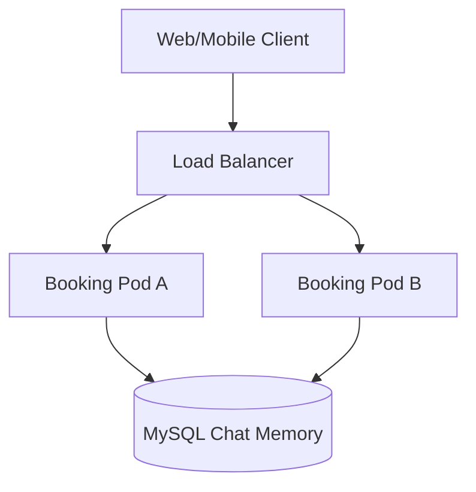

# BÀI 4: Tích hợp – Thiết kế ChatMemory bền vững cho Booking Agent

## 1. Giải pháp thiết kế và phân tách phiên chat

### 1.1. Nguyên nhân InMemoryChatMemory không phù hợp với Production

`InMemoryChatMemory` lưu lịch sử hội thoại trong RAM của một JVM. Cách này phù hợp với môi trường phát triển cục bộ nhưng không phù hợp khi hệ thống chạy trên nhiều Kubernetes Pod.

Giả sử khách hàng thực hiện ba lượt chat:

1. Request thứ nhất được Load Balancer chuyển đến Pod A;
2. Request thứ hai được chuyển đến Pod B;
3. Request thứ ba được chuyển đến Pod C.

Nếu mỗi Pod sử dụng `InMemoryChatMemory`, lịch sử sẽ bị chia nhỏ:

| Pod | Lịch sử nhìn thấy |
| --- | --- |
| Pod A | Chỉ thấy request thứ nhất |
| Pod B | Chỉ thấy request thứ hai |
| Pod C | Chỉ thấy request thứ ba |

Pod B không thể truy cập RAM của Pod A. Vì vậy, AI tại Pod B không biết nội dung khách hàng đã cung cấp ở request trước.

Ngoài ra, khi Pod bị restart, reschedule hoặc triển khai phiên bản mới, toàn bộ dữ liệu trong RAM bị xóa.

### 1.2. Kiến trúc lưu trữ tập trung bằng MySQL

Giải pháp là đưa lịch sử hội thoại ra khỏi RAM cục bộ và lưu trong MySQL dùng chung.



Tất cả Pod đều kết nối tới cùng một database:

- Pod A có thể ghi lịch sử;
- Pod B có thể đọc lại lịch sử do Pod A ghi;
- Pod bị restart không làm mất dữ liệu;
- Không bắt buộc sử dụng sticky session;
- Có thể scale-out bằng cách tăng số lượng Pod.

### 1.3. Phân tách hội thoại bằng conversationId

Mỗi cuộc hội thoại được gắn với một `conversationId` duy nhất.

Ví dụ:

```text
Khách hàng A → conversationId = dcf30a49-b67d-493e-a4ef-940c89421da5
Khách hàng B → conversationId = 2c67e383-82dc-4785-a803-02426682ce4b
```

Các message được lưu theo khóa `conversationId`.

Khi lấy lịch sử của khách hàng A, hệ thống chỉ truy vấn các message có `conversationId` của A. Lịch sử của khách hàng B không được đưa vào prompt của A.

Trong Spring AI, khóa Advisor Context tương ứng là:

```text
chat_memory_conversation_id
```

Ở các phiên bản Spring AI hiện hành, nên sử dụng hằng số:

```java
ChatMemory.CONVERSATION_ID
```

thay vì ghi trực tiếp chuỗi `"chat_memory_conversation_id"` để tránh lỗi chính tả và dễ nâng cấp framework.

### 1.4. Luồng tạo conversationId

Controller xử lý `conversationId` theo hai trường hợp.

#### Lượt chat đầu tiên

Client chưa có `conversationId`:

```json
{
  "message": "Tôi muốn tìm phòng Deluxe."
}
```

Server tạo UUID:

```java
UUID.randomUUID().toString()
```

Sau đó server:

1. Gán UUID vào `ChatMemory.CONVERSATION_ID`;
2. Gửi request tới `ChatClient`;
3. Trả UUID về cho Client cùng câu trả lời.

#### Các lượt chat tiếp theo

Client gửi lại UUID đã nhận:

```json
{
  "conversationId": "dcf30a49-b67d-493e-a4ef-940c89421da5",
  "message": "Tôi muốn nhận phòng vào ngày mai."
}
```

Server sử dụng đúng UUID đó để đọc lịch sử cũ từ MySQL.

Nếu Client không lưu và gửi lại `conversationId`, server sẽ hiểu đây là một cuộc hội thoại mới và tạo UUID khác.

## 2. Lưu ý về phiên bản Spring AI

Đề bài sử dụng tên `JdbcChatMemory`. Lớp này tồn tại trong các phiên bản Spring AI milestone cũ nhưng đã bị deprecated.

Trong Spring AI hiện hành, kiến trúc được tách thành:

- `JdbcChatMemoryRepository`: chịu trách nhiệm lưu và đọc message bằng JDBC;
- `MessageWindowChatMemory`: quản lý chiến lược giữ lại cửa sổ hội thoại;
- `MessageChatMemoryAdvisor`: đọc memory, bổ sung vào prompt và lưu lượt chat mới.

Do đó, bean trong bài được đặt tên là `jdbcChatMemory`, nhưng kiểu của bean là `ChatMemory` và phần lưu trữ bên dưới sử dụng `JdbcChatMemoryRepository`.

Đây là cách triển khai phù hợp hơn cho hệ thống Production hiện tại.

## 3. Khai báo dependency

### 3.1. pom.xml

```xml
<dependencies>
    <!-- Spring Web -->
    <dependency>
        <groupId>org.springframework.boot</groupId>
        <artifactId>spring-boot-starter-web</artifactId>
    </dependency>

    <!-- Bean Validation -->
    <dependency>
        <groupId>org.springframework.boot</groupId>
        <artifactId>spring-boot-starter-validation</artifactId>
    </dependency>

    <!-- JDBC và connection pool -->
    <dependency>
        <groupId>org.springframework.boot</groupId>
        <artifactId>spring-boot-starter-jdbc</artifactId>
    </dependency>

    <!-- Spring AI JDBC Chat Memory Repository -->
    <dependency>
        <groupId>org.springframework.ai</groupId>
        <artifactId>
            spring-ai-starter-model-chat-memory-repository-jdbc
        </artifactId>
    </dependency>

    <!-- MySQL JDBC Driver -->
    <dependency>
        <groupId>com.mysql</groupId>
        <artifactId>mysql-connector-j</artifactId>
        <scope>runtime</scope>
    </dependency>

    <!-- Chat model được hệ thống sử dụng -->
    <dependency>
        <groupId>org.springframework.ai</groupId>
        <artifactId>spring-ai-starter-model-openai</artifactId>
    </dependency>
</dependencies>
```

Version của Spring AI nên được quản lý bằng BOM để các module sử dụng cùng một phiên bản.

## 4. Cấu hình kết nối MySQL

### 4.1. application.yml dùng cho môi trường học tập

```yaml
spring:
  datasource:
    url: jdbc:mysql://${MYSQL_HOST:localhost}:3306/r_hotels
    username: ${MYSQL_USERNAME:rhotels_app}
    password: ${MYSQL_PASSWORD:change-me}
    driver-class-name: com.mysql.cj.jdbc.Driver

    hikari:
      maximum-pool-size: 20
      minimum-idle: 5
      connection-timeout: 30000
      idle-timeout: 600000
      max-lifetime: 1800000

  ai:
    chat:
      memory:
        repository:
          jdbc:
            initialize-schema: always
            platform: mysql
```

Cấu hình:

```yaml
initialize-schema: always
```

giúp Spring AI tự tạo bảng JDBC Chat Memory khi chạy bài thực hành.

Không nên ghi trực tiếp mật khẩu thật vào source code. Giá trị kết nối phải được truyền qua biến môi trường, Kubernetes Secret hoặc hệ thống quản lý secret.

### 4.2. Cấu hình khuyến nghị cho Production

Trong Production, schema database nên được quản lý bằng Flyway hoặc Liquibase:

```yaml
spring:
  ai:
    chat:
      memory:
        repository:
          jdbc:
            initialize-schema: never
```

Lợi ích:

- Schema được quản lý theo version;
- Có thể review migration trước khi deploy;
- Tránh nhiều Pod cùng chạy lệnh khởi tạo schema;
- Hỗ trợ rollback và kiểm toán thay đổi;
- An toàn hơn khi nâng cấp Spring AI.

Các phiên bản Spring AI mới sử dụng thêm cột `sequence_id` để bảo đảm thứ tự message. Vì vậy, khi nâng cấp từ phiên bản cũ, migration phải bổ sung cột và index tương ứng.

## 5. DatabaseChatMemoryConfig.java

```java
package com.rhotels.booking.config;

import javax.sql.DataSource;

import org.springframework.ai.chat.memory.ChatMemory;
import org.springframework.ai.chat.memory.MessageWindowChatMemory;
import org.springframework.ai.chat.memory.repository.jdbc
        .JdbcChatMemoryRepository;
import org.springframework.ai.chat.memory.repository.jdbc
        .JdbcChatMemoryRepositoryDialect;
import org.springframework.context.annotation.Bean;
import org.springframework.context.annotation.Configuration;
import org.springframework.jdbc.core.JdbcTemplate;
import org.springframework.transaction.PlatformTransactionManager;

@Configuration(proxyBeanMethods = false)
public class DatabaseChatMemoryConfig {

    /*
     * JdbcChatMemoryRepository chịu trách nhiệm lưu và đọc message
     * từ database MySQL thông qua JdbcTemplate.
     */
    @Bean
    public JdbcChatMemoryRepository jdbcChatMemoryRepository(
            JdbcTemplate jdbcTemplate,
            DataSource dataSource,
            PlatformTransactionManager transactionManager) {

        JdbcChatMemoryRepositoryDialect dialect =
                JdbcChatMemoryRepositoryDialect.from(dataSource);

        return JdbcChatMemoryRepository.builder()
                .jdbcTemplate(jdbcTemplate)
                .dialect(dialect)
                .transactionManager(transactionManager)
                .build();
    }

    /*
     * MessageWindowChatMemory quyết định số lượng message gần nhất
     * được giữ làm ngữ cảnh cho LLM.
     *
     * Dữ liệu của cửa sổ không còn nằm trong RAM của từng Pod.
     * Repository bên dưới sẽ lưu dữ liệu trong MySQL.
     */
    @Bean(name = "jdbcChatMemory")
    public ChatMemory jdbcChatMemory(
            JdbcChatMemoryRepository repository) {

        return MessageWindowChatMemory.builder()
                .chatMemoryRepository(repository)
                .maxMessages(40)
                .build();
    }
}
```

### Giải thích cấu hình

`JdbcTemplate` sử dụng `DataSource` do Spring Boot tạo từ cấu hình `spring.datasource`.

`JdbcChatMemoryRepositoryDialect.from(dataSource)` kiểm tra JDBC URL để lựa chọn câu lệnh SQL phù hợp với MySQL.

`PlatformTransactionManager` giúp các thao tác ghi memory được thực hiện trong transaction của database.

`MessageWindowChatMemory` quản lý một cửa sổ hội thoại có tối đa 40 message. Khi số lượng vượt quá giới hạn, các lượt cũ sẽ bị loại khỏi chat memory để tránh prompt tăng vô hạn.

Giới hạn này cần được điều chỉnh dựa trên:

- Context window của model;
- Chi phí token;
- Số lượng Tool call trong một lượt;
- Độ dài trung bình của hội thoại;
- Yêu cầu nghiệp vụ.

## 6. Cấu hình ChatClient với MessageChatMemoryAdvisor

### 6.1. BookingChatClientConfig.java

```java
package com.rhotels.booking.config;

import org.springframework.ai.chat.client.ChatClient;
import org.springframework.ai.chat.client.advisor
        .MessageChatMemoryAdvisor;
import org.springframework.ai.chat.memory.ChatMemory;
import org.springframework.context.annotation.Bean;
import org.springframework.context.annotation.Configuration;
import org.springframework.beans.factory.annotation.Qualifier;

import com.rhotels.booking.service.BookingService;

@Configuration(proxyBeanMethods = false)
public class BookingChatClientConfig {

    private static final String SYSTEM_PROMPT = """
        Bạn là AI Booking Agent của R-Hotels.

        Nhiệm vụ của bạn là hỗ trợ khách hàng:

        - Kiểm tra tình trạng phòng;
        - Xác định loại phòng;
        - Xác định ngày nhận và trả phòng;
        - Tính tổng chi phí lưu trú;
        - Hỏi lại khi thông tin chưa đầy đủ.

        Hãy sử dụng lịch sử hội thoại được cung cấp để duy trì
        ngữ cảnh giữa các lượt chat.

        Không được trộn thông tin của các khách hàng hoặc các
        cuộc hội thoại khác nhau.

        Khi dữ liệu chưa đầy đủ, hãy hỏi lại người dùng thay vì
        tự suy đoán.
        """;

    @Bean
    public ChatClient bookingChatClient(
            ChatClient.Builder builder,
            @Qualifier("jdbcChatMemory") ChatMemory chatMemory,
            BookingService bookingService) {

        MessageChatMemoryAdvisor memoryAdvisor =
                MessageChatMemoryAdvisor.builder(chatMemory)
                        .build();

        return builder
                .defaultSystem(SYSTEM_PROMPT)
                .defaultAdvisors(memoryAdvisor)
                .defaultTools(bookingService)
                .build();
    }
}
```

`MessageChatMemoryAdvisor` thực hiện hai nhiệm vụ chính:

1. Trước khi gửi prompt tới LLM, Advisor đọc các message cũ từ `ChatMemory` dựa trên `conversationId` và bổ sung chúng vào prompt;
2. Sau khi LLM trả lời, Advisor lưu message của người dùng và phản hồi của AI vào memory tương ứng.

Controller không phải tự gọi:

```java
chatMemory.add(...)
```

hoặc:

```java
chatMemory.get(...)
```

vì Advisor đã thực hiện các bước này.

## 7. Đối tượng request và response

### 7.1. BookingChatRequest.java

```java
package com.rhotels.booking.dto;

import jakarta.validation.constraints.NotBlank;
import jakarta.validation.constraints.Size;

public record BookingChatRequest(

        /*
         * Có thể null hoặc rỗng trong lượt chat đầu tiên.
         * Nếu có giá trị, Controller sẽ kiểm tra định dạng UUID.
         */
        @Size(
            max = 36,
            message = "conversationId không được dài quá 36 ký tự"
        )
        String conversationId,

        @NotBlank(message = "message không được để trống")
        @Size(
            max = 4000,
            message = "message không được dài quá 4000 ký tự"
        )
        String message) {
}
```

### 7.2. BookingChatResponse.java

```java
package com.rhotels.booking.dto;

public record BookingChatResponse(
        String conversationId,
        boolean newConversation,
        String answer) {
}
```

Response bắt buộc trả lại `conversationId`. Nếu server chỉ trả nội dung AI mà không trả ID, Client sẽ không biết ID nào cần gửi trong lượt tiếp theo.

## 8. REST Controller sau khi tích hợp Persistent Memory

### 8.1. BookingController.java

```java
package com.rhotels.booking.controller;

import java.util.UUID;

import org.springframework.ai.chat.client.ChatClient;
import org.springframework.ai.chat.memory.ChatMemory;
import org.springframework.http.HttpStatus;
import org.springframework.util.StringUtils;
import org.springframework.web.bind.annotation.PostMapping;
import org.springframework.web.bind.annotation.RequestBody;
import org.springframework.web.bind.annotation.RequestMapping;
import org.springframework.web.bind.annotation.RestController;
import org.springframework.web.server.ResponseStatusException;

import com.rhotels.booking.dto.BookingChatRequest;
import com.rhotels.booking.dto.BookingChatResponse;

import jakarta.validation.Valid;

@RestController
@RequestMapping("/api/booking")
public class BookingController {

    private final ChatClient chatClient;

    public BookingController(ChatClient bookingChatClient) {
        this.chatClient = bookingChatClient;
    }

    @PostMapping("/chat")
    public BookingChatResponse chat(
            @Valid @RequestBody BookingChatRequest request) {

        ResolvedConversation resolvedConversation =
                resolveConversationId(request.conversationId());

        String answer = this.chatClient
                .prompt()
                .user(request.message().strip())
                .advisors(advisor -> advisor.param(
                        ChatMemory.CONVERSATION_ID,
                        resolvedConversation.conversationId()
                ))
                .call()
                .content();

        return new BookingChatResponse(
                resolvedConversation.conversationId(),
                resolvedConversation.newConversation(),
                answer
        );
    }

    /*
     * Nếu Client không truyền conversationId, server tạo UUID mới.
     *
     * Nếu Client có truyền ID, server chỉ chấp nhận UUID hợp lệ.
     * Không tự động thay ID sai bằng UUID mới vì điều đó có thể
     * che giấu lỗi của Client và vô tình tạo nhiều phiên rác.
     */
    private ResolvedConversation resolveConversationId(
            String rawConversationId) {

        if (!StringUtils.hasText(rawConversationId)) {
            return new ResolvedConversation(
                    UUID.randomUUID().toString(),
                    true
            );
        }

        String normalizedId = rawConversationId.strip();

        try {
            UUID parsedUuid = UUID.fromString(normalizedId);
            String canonicalId = parsedUuid.toString();

            /*
             * Bảo đảm Client truyền UUID ở dạng chuẩn 36 ký tự.
             */
            if (!canonicalId.equalsIgnoreCase(normalizedId)) {
                throw new IllegalArgumentException(
                        "UUID không ở dạng chuẩn"
                );
            }

            return new ResolvedConversation(
                    canonicalId,
                    false
            );
        }
        catch (IllegalArgumentException exception) {
            throw new ResponseStatusException(
                    HttpStatus.BAD_REQUEST,
                    "conversationId phải là UUID hợp lệ",
                    exception
            );
        }
    }

    private record ResolvedConversation(
            String conversationId,
            boolean newConversation) {
    }
}
```

### 8.2. Thuộc tính được truyền cho Advisor

Dòng code quan trọng nhất là:

```java
.advisors(advisor -> advisor.param(
        ChatMemory.CONVERSATION_ID,
        resolvedConversation.conversationId()
))
```

Giá trị của hằng số:

```java
ChatMemory.CONVERSATION_ID
```

tương ứng với:

```text
chat_memory_conversation_id
```

Tham số này phải được truyền trong mỗi request sử dụng Memory Advisor.

Không được lưu `conversationId` vào một biến instance của Controller như sau:

```java
private String conversationId;
```

Controller của Spring thường là singleton. Nếu lưu `conversationId` trong biến instance, nhiều request đồng thời có thể ghi đè giá trị của nhau và làm trộn phiên chat.

Trong code đã refactor, `conversationId` chỉ tồn tại trong biến cục bộ của từng request nên an toàn hơn trong môi trường đa luồng.

## 9. Ví dụ gọi API

### 9.1. Lượt chat đầu tiên

Request chưa có `conversationId`:

```http
POST /api/booking/chat
Content-Type: application/json
```

```json
{
  "message": "Tôi tên Nam và muốn tìm phòng Deluxe."
}
```

Response:

```json
{
  "conversationId": "dcf30a49-b67d-493e-a4ef-940c89421da5",
  "newConversation": true,
  "answer": "Chào anh Nam. Anh muốn nhận phòng và trả phòng vào ngày nào?"
}
```

Client phải lưu:

```text
dcf30a49-b67d-493e-a4ef-940c89421da5
```

### 9.2. Lượt chat tiếp theo

```http
POST /api/booking/chat
Content-Type: application/json
```

```json
{
  "conversationId": "dcf30a49-b67d-493e-a4ef-940c89421da5",
  "message": "Tôi muốn nhận phòng vào ngày mai và ở 3 đêm."
}
```

Advisor đọc lịch sử theo `conversationId`. AI có thể nhớ người dùng tên Nam và đang tìm phòng Deluxe dù request thứ hai được chuyển sang Pod khác.

Response:

```json
{
  "conversationId": "dcf30a49-b67d-493e-a4ef-940c89421da5",
  "newConversation": false,
  "answer": "Anh Nam muốn ở phòng Deluxe trong 3 đêm. Tôi sẽ kiểm tra phòng cho khoảng thời gian đó."
}
```

### 9.3. Bắt đầu cuộc hội thoại mới

Muốn tạo một cuộc hội thoại mới, Client gửi request không có `conversationId`:

```json
{
  "message": "Tôi muốn bắt đầu một yêu cầu đặt phòng mới."
}
```

Server sẽ tạo UUID mới và không tải lịch sử của cuộc hội thoại trước.

## 10. Thuyết minh cơ chế đồng bộ dữ liệu

### 10.1. Khi nhận một request

Giả sử request được chuyển tới Pod A.

Pod A thực hiện:

1. Nhận `conversationId` từ Client;
2. Gán ID vào `ChatMemory.CONVERSATION_ID`;
3. `MessageChatMemoryAdvisor` truy vấn MySQL theo ID;
4. Các message cũ được lấy theo đúng thứ tự;
5. Advisor bổ sung lịch sử vào prompt;
6. Prompt được gửi tới LLM;
7. LLM tạo phản hồi;
8. Advisor lưu message mới của người dùng và AI vào MySQL;
9. Controller trả phản hồi cùng `conversationId`.

### 10.2. Khi request tiếp theo đến Pod khác

Request tiếp theo có thể được Load Balancer chuyển tới Pod B.

Pod B không cần truy cập RAM của Pod A. Nó chỉ cần:

1. Nhận cùng `conversationId`;
2. Truy vấn cùng database MySQL;
3. Đọc các message mà Pod A đã lưu;
4. Tiếp tục hội thoại.

Do đó, trạng thái hội thoại không còn gắn với vòng đời của Pod.

### 10.3. Khi Pod bị restart

Khi Pod A bị restart:

- RAM của Pod A bị xóa;
- Bean `ChatClient` và `ChatMemory` được tạo lại;
- Dữ liệu trong MySQL vẫn còn;
- Pod mới vẫn đọc được lịch sử bằng `conversationId`.

Điều kiện là MySQL phải sử dụng persistent volume, dịch vụ database được quản lý hoặc cơ chế lưu trữ bền vững độc lập với Kubernetes Pod.

### 10.4. Cơ chế phân tách phiên

Các bản ghi được phân vùng logic theo `conversationId`.

Ví dụ:

| conversation_id | type | content |
| --- | --- | --- |
| `uuid-A` | USER | Tôi tên Nam |
| `uuid-A` | ASSISTANT | Chào anh Nam |
| `uuid-B` | USER | Tôi tên Lan |
| `uuid-B` | ASSISTANT | Chào chị Lan |

Khi truy vấn `uuid-A`, hệ thống không lấy message của `uuid-B`.

Điều này bảo đảm phân tách ngữ cảnh ở mức lưu trữ và prompt.

## 11. Các điểm cần lưu ý trong Production

### 11.1. UUID không thay thế cơ chế xác thực và phân quyền

UUID ngẫu nhiên khó đoán hơn số tăng dần nhưng không phải cơ chế phân quyền.

Nếu Client biết `conversationId` của người khác và server không kiểm tra quyền sở hữu, Client có thể gửi ID đó để truy cập hội thoại không thuộc về mình.

Trong hệ thống thực tế cần lưu quan hệ:

```text
conversationId → authenticatedUserId
```

Mỗi request phải kiểm tra:

```text
conversation.ownerId == currentAuthenticatedUser.id
```

Nếu không khớp, trả về HTTP 403.

Vì vậy, session-safety đầy đủ cần hai lớp:

1. `conversationId` phân tách dữ liệu;
2. Authentication và authorization kiểm tra chủ sở hữu.

### 11.2. Hai request đồng thời trong cùng một conversation

MySQL dùng chung giúp các Pod nhìn thấy cùng dữ liệu, nhưng không tự động bảo đảm hai request đồng thời của cùng một cuộc hội thoại được xử lý theo đúng thứ tự nghiệp vụ.

Ví dụ:

1. Client gửi đồng thời request A và B;
2. Pod 1 và Pod 2 cùng đọc một phiên bản lịch sử;
3. Cả hai gọi LLM trước khi request còn lại ghi kết quả;
4. Hai câu trả lời có thể không nhìn thấy nhau.

Để xử lý triệt để, có thể áp dụng:

- Client chỉ gửi lượt tiếp theo sau khi nhận lượt trước;
- Distributed lock theo `conversationId`;
- Hàng đợi theo từng conversation;
- Optimistic locking với version;
- Idempotency key cho mỗi request;
- Trả HTTP 409 khi một conversation đang được xử lý.

Persistent memory giải quyết vấn đề dùng chung dữ liệu giữa các Pod, nhưng không đồng nghĩa với việc tự động tuần tự hóa các request đồng thời.

### 11.3. Chat Memory không đồng nghĩa với lịch sử kiểm toán đầy đủ

`MessageWindowChatMemory` chỉ giữ một cửa sổ message để đưa vào prompt. Khi vượt quá `maxMessages`, các message cũ có thể bị loại khỏi memory.

Nếu R-Hotels cần lưu toàn bộ lịch sử để:

- Chăm sóc khách hàng;
- Giải quyết khiếu nại;
- Kiểm toán;
- Phân tích dữ liệu;
- Tuân thủ pháp lý;

thì nên có thêm một bảng `chat_history` riêng. Không nên sử dụng `ChatMemory` như kho lưu trữ lịch sử vĩnh viễn duy nhất.

### 11.4. Giới hạn hiện tại với Tool Calling

`JdbcChatMemoryRepository` phù hợp để lưu user message và assistant response phục vụ ngữ cảnh hội thoại. Tuy nhiên, tùy phiên bản Spring AI, các message trung gian của quá trình Tool Calling có thể không được lưu đầy đủ.

Do đó, không nên giả định rằng database memory chứa đầy đủ mọi Tool request và Tool response để phục vụ kiểm toán.

Nếu cần lưu toàn bộ Tool execution, hệ thống nên có thêm:

- Audit log riêng;
- Bảng tool execution;
- Correlation ID;
- Thời gian thực thi;
- Tham số đã được che dữ liệu nhạy cảm;
- Kết quả hoặc mã lỗi.

### 11.5. Bảo mật dữ liệu hội thoại

Lịch sử đặt phòng có thể chứa:

- Họ tên;
- Số điện thoại;
- Email;
- Ngày lưu trú;
- Yêu cầu đặc biệt;
- Thông tin khách hàng thân thiết.

Vì vậy, hệ thống cần:

- Mã hóa kết nối MySQL bằng TLS;
- Không ghi nội dung nhạy cảm vào log;
- Giới hạn quyền database của tài khoản ứng dụng;
- Có chính sách thời gian lưu giữ dữ liệu;
- Hỗ trợ xóa hội thoại theo yêu cầu;
- Backup và kiểm thử phục hồi;
- Theo dõi truy cập bất thường.

## 12. Cấu hình theo đúng API JdbcChatMemory cũ của đề bài

Nếu dự án học tập đang sử dụng Spring AI `1.0.0-M8` hoặc phiên bản còn hỗ trợ trực tiếp `JdbcChatMemory`, lớp cấu hình có thể được viết như sau:

```java
package com.rhotels.booking.config;

import org.springframework.ai.chat.memory.jdbc.JdbcChatMemory;
import org.springframework.ai.chat.memory.jdbc.JdbcChatMemoryConfig;
import org.springframework.context.annotation.Bean;
import org.springframework.context.annotation.Configuration;
import org.springframework.jdbc.core.JdbcTemplate;

@Configuration(proxyBeanMethods = false)
public class DatabaseChatMemoryConfig {

    @Bean
    public JdbcChatMemory jdbcChatMemory(
            JdbcTemplate jdbcTemplate) {

        JdbcChatMemoryConfig config =
                JdbcChatMemoryConfig.builder()
                        .jdbcTemplate(jdbcTemplate)
                        .build();

        return JdbcChatMemory.create(config);
    }
}
```

ChatClient được cấu hình:

```java
package com.rhotels.booking.config;

import org.springframework.ai.chat.client.ChatClient;
import org.springframework.ai.chat.client.advisor
        .MessageChatMemoryAdvisor;
import org.springframework.ai.chat.memory.jdbc.JdbcChatMemory;
import org.springframework.context.annotation.Bean;
import org.springframework.context.annotation.Configuration;

import com.rhotels.booking.service.BookingService;

@Configuration(proxyBeanMethods = false)
public class BookingChatClientConfig {

    @Bean
    public ChatClient bookingChatClient(
            ChatClient.Builder builder,
            JdbcChatMemory jdbcChatMemory,
            BookingService bookingService) {

        return builder
                .defaultSystem(
                    "Bạn là AI Booking Agent của R-Hotels."
                )
                .defaultAdvisors(
                    new MessageChatMemoryAdvisor(jdbcChatMemory)
                )
                .defaultTools(bookingService)
                .build();
    }
}
```

Với API Advisor cũ, Controller có thể sử dụng hằng số:

```java
import static org.springframework.ai.chat.client.advisor
        .AbstractChatMemoryAdvisor
        .CHAT_MEMORY_CONVERSATION_ID_KEY;
```

Sau đó truyền ID:

```java
.advisors(advisor -> advisor.param(
        CHAT_MEMORY_CONVERSATION_ID_KEY,
        conversationId
))
```

Hằng số cũ cũng có giá trị:

```text
chat_memory_conversation_id
```

Tuy nhiên, `JdbcChatMemory` trực tiếp và hằng số trong `AbstractChatMemoryAdvisor` đã bị deprecated. Khi dùng Spring AI hiện hành, nên sử dụng:

```java
JdbcChatMemoryRepository
MessageWindowChatMemory
ChatMemory.CONVERSATION_ID
```

## 13. Kết luận

Giải pháp thay thế InMemory Chat Memory bằng JDBC Chat Memory trên MySQL mang lại các lợi ích:

- Lịch sử không phụ thuộc RAM của từng Pod;
- Request có thể được định tuyến tới bất kỳ Pod nào;
- Không mất hội thoại khi Pod restart;
- Hỗ trợ scale-out;
- Phân tách các cuộc hội thoại bằng `conversationId`;
- Tự tạo UUID cho lượt chat đầu tiên;
- Trả UUID về Client để tiếp tục phiên;
- Memory Advisor tự động đọc và ghi lịch sử;
- Không cần sticky session.

Luồng xử lý chính là:

```text
Client gửi message và conversationId
→ Controller kiểm tra hoặc tạo UUID
→ Gán UUID vào chat_memory_conversation_id
→ Advisor đọc lịch sử từ MySQL
→ LLM xử lý với ngữ cảnh cũ
→ Advisor lưu lượt chat mới
→ Server trả answer và conversationId cho Client
```

Tuy nhiên, để đạt tiêu chuẩn Production đầy đủ, hệ thống vẫn phải bổ sung:

- Kiểm tra quyền sở hữu conversation;
- Xử lý request đồng thời trên cùng một conversation;
- Migration database bằng Flyway hoặc Liquibase;
- Chính sách lưu giữ và xóa dữ liệu;
- Audit riêng cho Tool Calling;
- Backup, monitoring và bảo mật database.

## Tài liệu tham khảo

- [Spring AI Reference – Chat Memory](https://docs.spring.io/spring-ai/reference/api/chat-memory.html)
- [Spring AI Reference – Advisors API](https://docs.spring.io/spring-ai/reference/api/advisors.html)
- [Spring AI Reference – ChatClient API](https://docs.spring.io/spring-ai/reference/api/chatclient.html)
- [Spring AI Reference – Upgrade Notes](https://docs.spring.io/spring-ai/reference/upgrade-notes.html)
